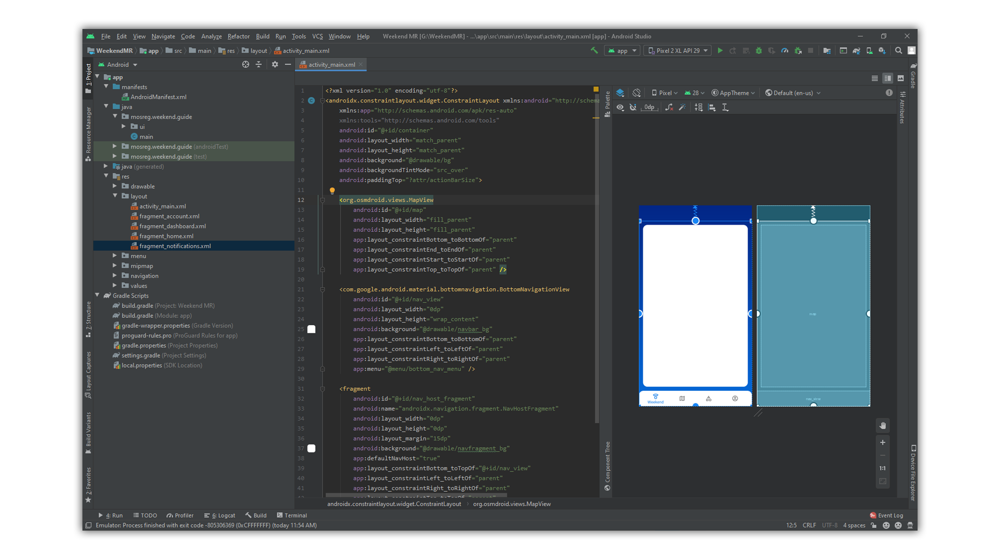
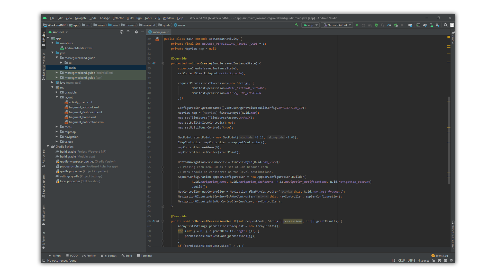

## Использование OpenStreetMap в проекте Android Studio

В этой статье мы рассмотрим использование OpenStreetMap на примере android приложения WeekendMR.

Вся информация была взята из откртых источников. 

### Интеграция нужных библиотек

Для начала работы нужно интегрировать необходимые библиотеки в проект. Делать это нужно в файле _build.gradle (Module: app)_

```
    implementation 'org.osmdroid:osmdroid-android:6.1.1'
    implementation 'org.osmdroid:osmdroid-wms:6.1.1'
    implementation 'org.osmdroid:osmdroid-mapsforge:6.1.1'
    implementation 'org.osmdroid:osmdroid-geopackage:5.6.4'
```


### Установка небходимых разрешений

Для корректной работы приложения, ему нужны разрашения. В файле _AndroidManifest.xml_ прописываем следующее

```xml
    <uses-permission android:name="android.permission.ACCESS_FINE_LOCATION"/>
    <uses-permission android:name="android.permission.INTERNET" />
    <uses-permission android:name="android.permission.ACCESS_NETWORK_STATE"  />
    <uses-permission android:name="android.permission.WRITE_EXTERNAL_STORAGE" />
```


### Получение необходимых разрешений

Начиная с android 6.0 приложению необходимо запрашивать у пользователя разрешения. Для этого нужно прописать следующий код в java файле главного activity.

```java
public class main extends AppCompatActivity {
    private final int REQUEST_PERMISSIONS_REQUEST_CODE = 1;
    private MapView map = null;

    @Override
    protected void onCreate(Bundle savedInstanceState) {
        super.onCreate(savedInstanceState);
        setContentView(R.layout.activity_main);

        requestPermissionsIfNecessary(new String[] {
                Manifest.permission.WRITE_EXTERNAL_STORAGE,
                Manifest.permission.ACCESS_FINE_LOCATION
        });
        
        
    }

    @Override
    public void onRequestPermissionsResult(int requestCode, String[] permissions, int[] grantResults) {
        ArrayList<String> permissionsToRequest = new ArrayList<>();
        for (int i = 0; i < grantResults.length; i++) {
            permissionsToRequest.add(permissions[i]);
        }
        if (permissionsToRequest.size() > 0) {
            ActivityCompat.requestPermissions(
                    this,
                    permissionsToRequest.toArray(new String[0]),
                    REQUEST_PERMISSIONS_REQUEST_CODE);
        }
    }

    private void requestPermissionsIfNecessary(String[] permissions) {
        ArrayList<String> permissionsToRequest = new ArrayList<>();
        for (String permission : permissions) {
            if (ContextCompat.checkSelfPermission(this, permission)
                    != PackageManager.PERMISSION_GRANTED) {
                // Permission is not granted
                permissionsToRequest.add(permission);
            }
        }
        if (permissionsToRequest.size() > 0) {
            ActivityCompat.requestPermissions(
                    this,
                    permissionsToRequest.toArray(new String[0]),
                    REQUEST_PERMISSIONS_REQUEST_CODE);
        }
    }
}

```


### Создание карты

Для создание карты в xml файле нужного activity пропишите следующее

```xml
    <org.osmdroid.views.MapView
        android:id="@+id/map"
        android:layout_width="fill_parent"
        android:layout_height="fill_parent"
        app:layout_constraintBottom_toBottomOf="parent"
        app:layout_constraintEnd_toEndOf="parent"
        app:layout_constraintStart_toStartOf="parent"
        app:layout_constraintTop_toTopOf="parent" />
```


### Логика карты

Чтобы карты работали необходимо настроить её логику. Для этого в java файле нужного activity прописываем следующее

```java
public class main extends AppCompatActivity {
    private MapView map = null;

    @Override
    protected void onCreate(Bundle savedInstanceState) {
        super.onCreate(savedInstanceState);
        setContentView(R.layout.activity_main);
       
        Configuration.getInstance().setUserAgentValue(BuildConfig.APPLICATION_ID);
        MapView map = (MapView) findViewById(R.id.map);
        map.setTileSource(TileSourceFactory.MAPNIK);
        map.setBuiltInZoomControls(true);
        map.setMultiTouchControls(true);

        GeoPoint startPoint = new GeoPoint(48.13, -1.63);
        IMapController mapController = map.getController();
        mapController.setZoom(9);
        mapController.setCenter(startPoint);
    }
```


> Не забудьте импортировать необходимые для работы билиотеки в java файл нужного экрана!
```java
import org.osmdroid.api.IMapController;
import org.osmdroid.config.Configuration;
import org.osmdroid.tileprovider.tilesource.TileSourceFactory;
import org.osmdroid.util.GeoPoint;
import org.osmdroid.views.MapView;
```

