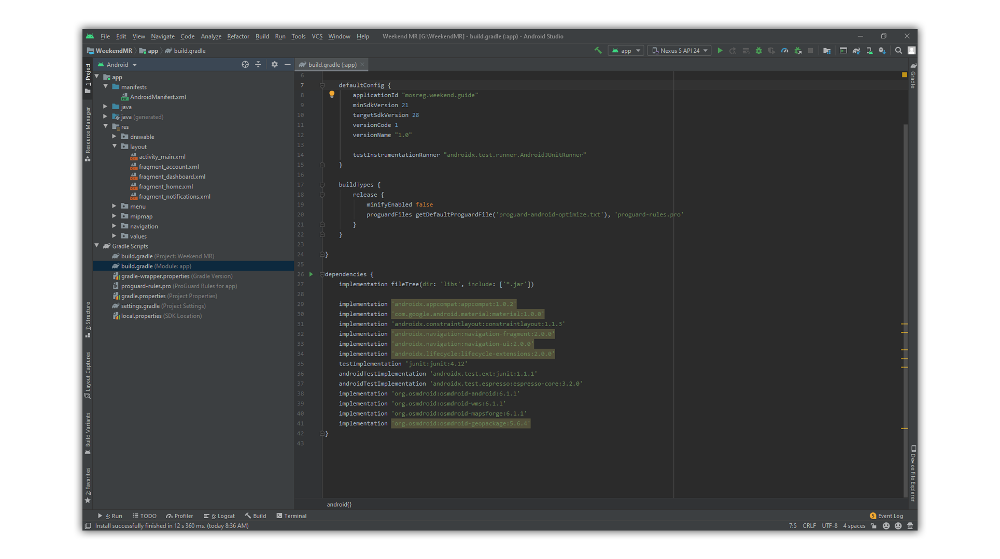
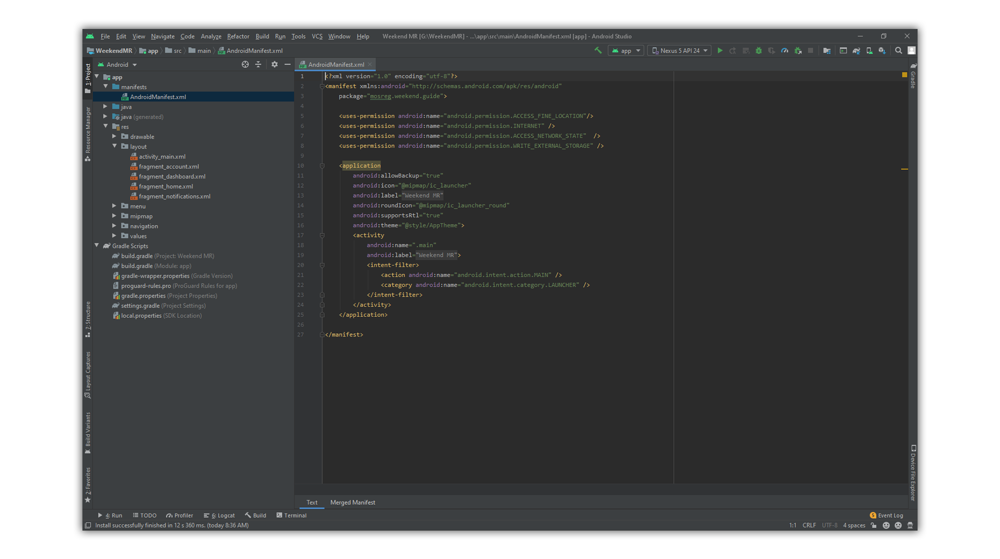
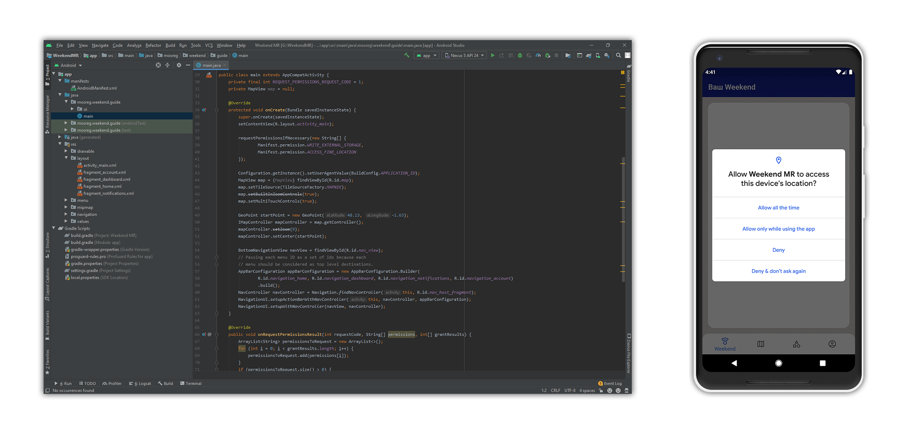

## Использование OpenStreetMap в проекте Android Studio

В этой статье мы рассмотрим использование OpenStreetMap на примере android приложения WeekendMR.

Вся информация была взята из откртых источников. 

### Интеграция нужных библиотек

Для начала работы нужно интегрировать необходимые библиотеки в проект. Делать это нужно в файле _build.gradle (Module: app)_

```markdown
    implementation 'org.osmdroid:osmdroid-android:6.1.1'
    implementation 'org.osmdroid:osmdroid-wms:6.1.1'
    implementation 'org.osmdroid:osmdroid-mapsforge:6.1.1'
    implementation 'org.osmdroid:osmdroid-geopackage:5.6.4'
```


### Установка небходимых разрешений

Для корректной работы приложения, ему нужны разрашения. В файле _AndroidManifest.xml_ прописываем следующее

```markdown
    <uses-permission android:name="android.permission.ACCESS_FINE_LOCATION"/>
    <uses-permission android:name="android.permission.INTERNET" />
    <uses-permission android:name="android.permission.ACCESS_NETWORK_STATE"  />
    <uses-permission android:name="android.permission.WRITE_EXTERNAL_STORAGE" />
```


### Получение необходимых разрешений

Начиная с android 6.0 приложению необходимо запрашивать у пользователя разрешения. Для этого нужно прописать следующий код в java файле главного activity.

```markdown
public class main extends AppCompatActivity {
    private final int REQUEST_PERMISSIONS_REQUEST_CODE = 1;
    private MapView map = null;

    @Override
    protected void onCreate(Bundle savedInstanceState) {
        super.onCreate(savedInstanceState);
        setContentView(R.layout.activity_main);

        requestPermissionsIfNecessary(new String[] {
                Manifest.permission.WRITE_EXTERNAL_STORAGE,
                Manifest.permission.ACCESS_FINE_LOCATION
        });
        
        
    }

    @Override
    public void onRequestPermissionsResult(int requestCode, String[] permissions, int[] grantResults) {
        ArrayList<String> permissionsToRequest = new ArrayList<>();
        for (int i = 0; i < grantResults.length; i++) {
            permissionsToRequest.add(permissions[i]);
        }
        if (permissionsToRequest.size() > 0) {
            ActivityCompat.requestPermissions(
                    this,
                    permissionsToRequest.toArray(new String[0]),
                    REQUEST_PERMISSIONS_REQUEST_CODE);
        }
    }

    private void requestPermissionsIfNecessary(String[] permissions) {
        ArrayList<String> permissionsToRequest = new ArrayList<>();
        for (String permission : permissions) {
            if (ContextCompat.checkSelfPermission(this, permission)
                    != PackageManager.PERMISSION_GRANTED) {
                // Permission is not granted
                permissionsToRequest.add(permission);
            }
        }
        if (permissionsToRequest.size() > 0) {
            ActivityCompat.requestPermissions(
                    this,
                    permissionsToRequest.toArray(new String[0]),
                    REQUEST_PERMISSIONS_REQUEST_CODE);
        }
    }
}

```
 

### Создание карты

Для создание карты в xml файле нужного activity пропишите следующее

```markdow
    <org.osmdroid.views.MapView
        android:id="@+id/map"
        android:layout_width="fill_parent"
        android:layout_height="fill_parent"
        app:layout_constraintBottom_toBottomOf="parent"
        app:layout_constraintEnd_toEndOf="parent"
        app:layout_constraintStart_toStartOf="parent"
        app:layout_constraintTop_toTopOf="parent" />
```


### Markdown

Markdown is a lightweight and easy-to-use syntax for styling your writing. It includes conventions for

```markdown
Syntax highlighted code block

# Header 1
## Header 2
### Header 3

- Bulleted
- List

1. Numbered
2. List

**Bold** and _Italic_ and `Code` text

[Link](url) and 
```

For more details see [GitHub Flavored Markdown](https://guides.github.com/features/mastering-markdown/).

### Jekyll Themes

Your Pages site will use the layout and styles from the Jekyll theme you have selected in your [repository settings](https://github.com/WeekendMR/wrmosmd/settings). The name of this theme is saved in the Jekyll `_config.yml` configuration file.

### Support or Contact

Having trouble with Pages? Check out our [documentation](https://help.github.com/categories/github-pages-basics/) or [contact support](https://github.com/contact) and we’ll help you sort it out.
